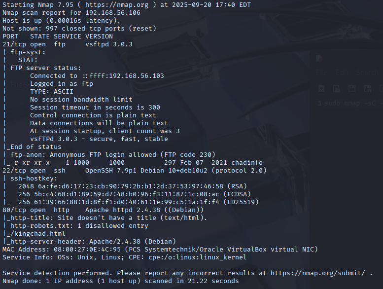
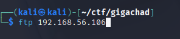
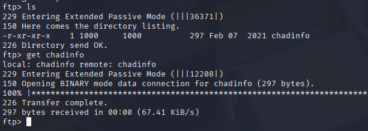
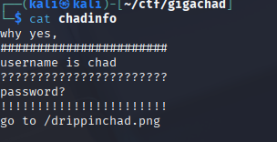
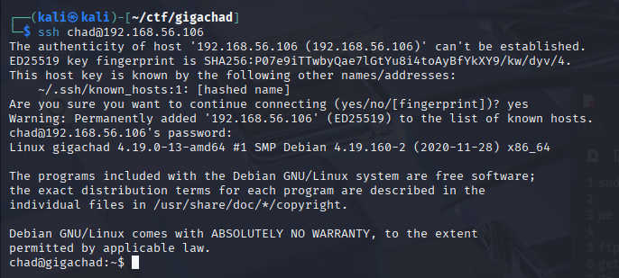
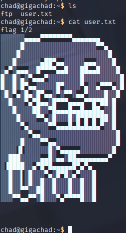
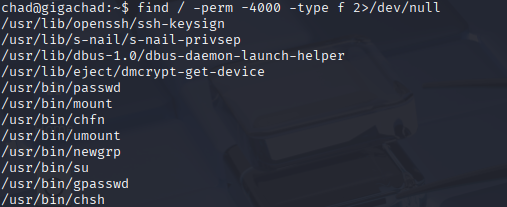
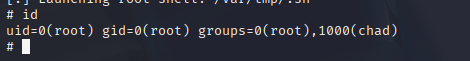
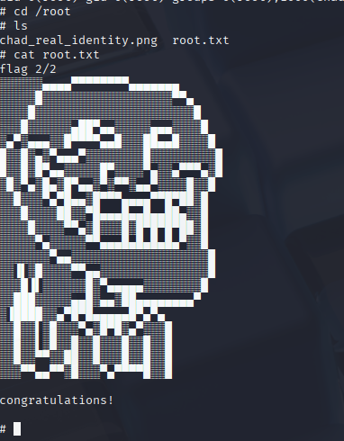

# Hello.
## CTF: GigaChad (Vulnhub)
* IP: 192.168.56.106

## NMAP SCAN:



After nmap scan we can see: 
* 21 port(ftp) - anonymous loign allowed(vuln)
* 22 port(ssh)
* 80 port(http)

## FTP EXPLOITING:





## Information from FTP:
* username: chad
* subdomain: http://$IP/drippinchad.png

On picture we can see build, if try find what is that build we can find - **maiden's tower**    



This might be password if cut space and \ ' \ symbol 

## SSH EXPLOITTING:
Now we have creds and can try ssh. . . 



```bash
ssh chad@192.168.56.106
password: maidenstower
```

And BOOM. We're in!!!

## Getting #1 flag:



## Privilege escalation:
```bash
find / -perm -4000 -type f 2>/dev/null
```



* /usr/lib/s-nail/s-nail-privesp

Using Google we can find interesting    

### **CVE 2017-5899**

Exploiting this machine using CVE 2017-5899

and. . .


## Getting #2 flag:



# GoodBye.
##### by hello-im-404/r31v14n

