# Hello.

CTF: Blog(medium)

ip: 10.10.62.255

nmap scan

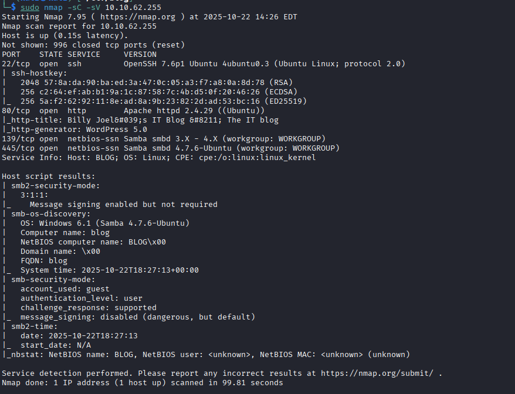

ffuf results:

interesting admin

okay, this redirect on wp-login.

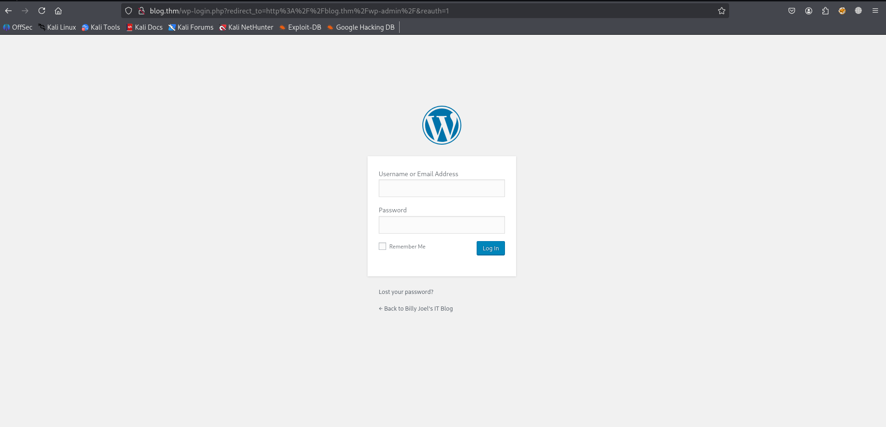

default "admin" didn't working? Okay, maybe "Billy" will work?

no...

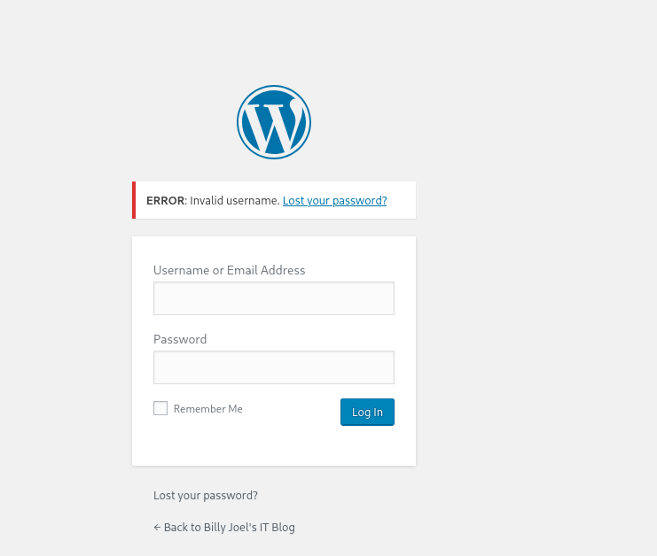

okay, enum4linux maybe gives me smth interesting

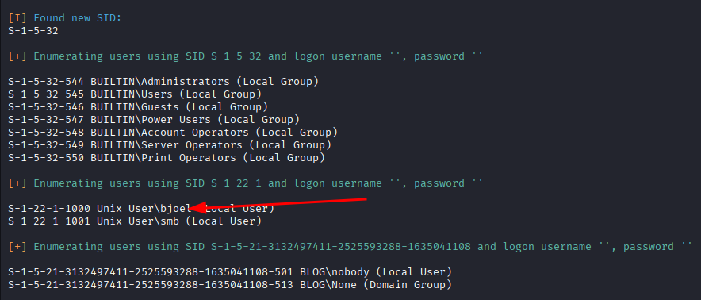

bjoel - this might be as login.

on this moment i open writeup....and....needed login: kwheel, sorry, idk how i should find this login.

using wpscan we can brute force password for kwheel

okay, login in

kwheel:cutiepie1

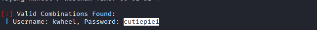

i'll use exploit - WordPress 5.0.0 - Image Remote Code Execution

starting metasploit. . .

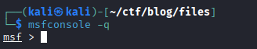

setting options and exploit

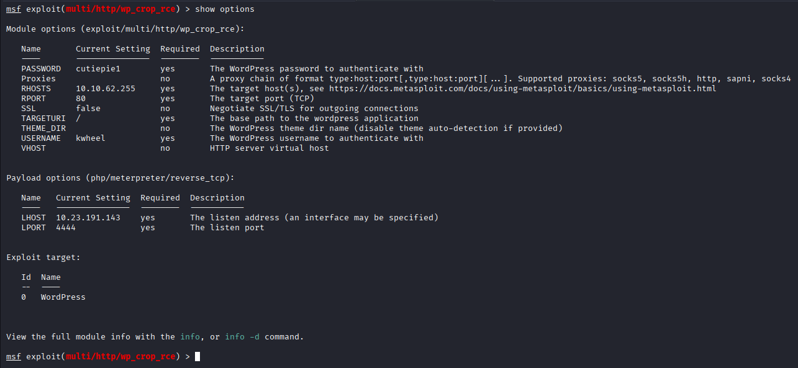

and boom. nice!

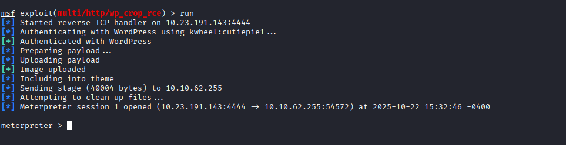

getting shell

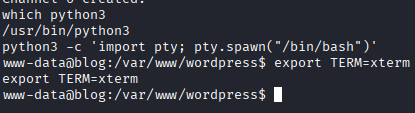

okay, going to home directory....and.....that's not funny:(

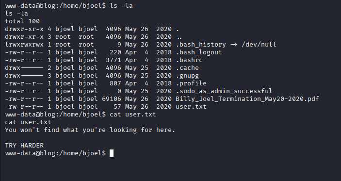

trying find

checker have vuln:
root@blog:/var/www/wordpress# ltrace checker
ltrace checker
getenv("admin")                                  = "1"
setuid(0)                                        = 0
system("/bin/bash"root@blog:/var/www/wordpress#

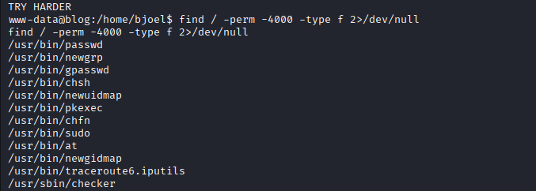

and if we will export admin=1

we should get root priv.

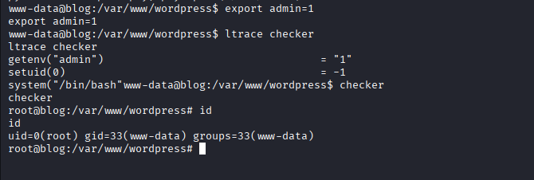

finding user.txt with command:

find / 2>/dev/null | grep user.txt

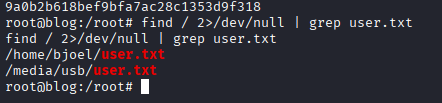

and root flag in home directory.

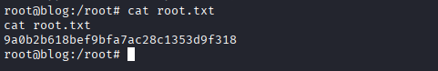

Ty all for reading!!

# Goodbye.
