# Hello.

CTF: Mindgames(meduim) TryHackMe
IP: 10.10.138.42

nmap results:
22 port(ssh)
80 port(http)

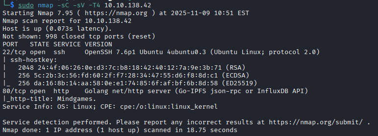

okay, 80 port going to website.

Okay, trying input and this is brainfxck compiler, i wanna try decode this code.

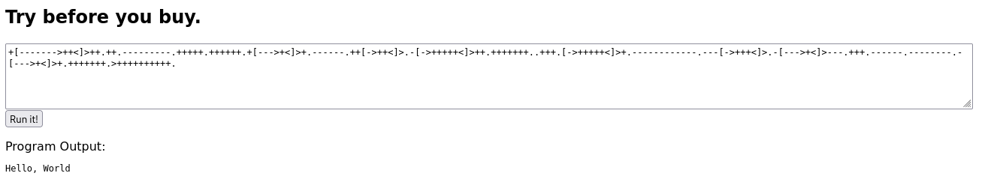

I openned dcode.fr and what i can see? This is python code, encoded in brainfxck and then our machine's website decoding brainfxck code to python and EXECUTE PYTHON CODE.

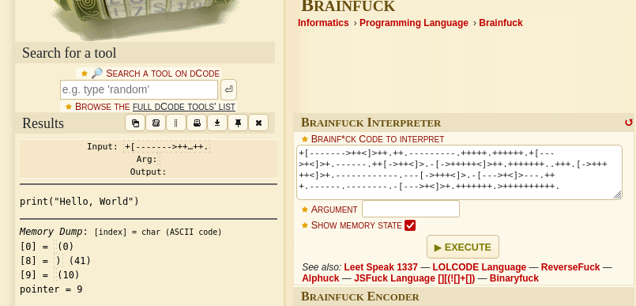
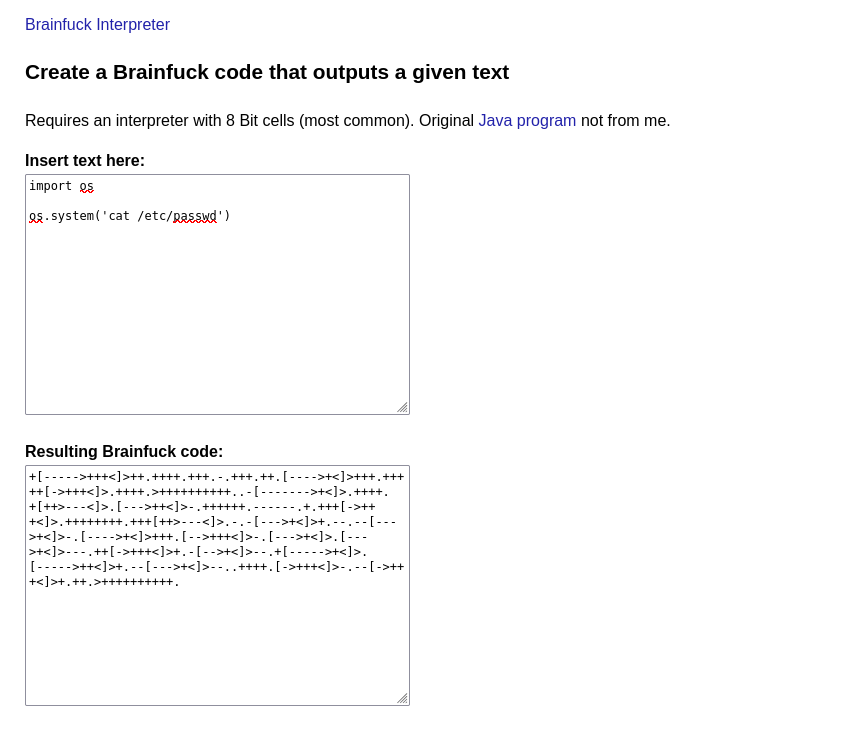

Okay, what if i'll try read /etc/passwd?

YES! this is RCE(might be), i'll try to get reverse shell using python.

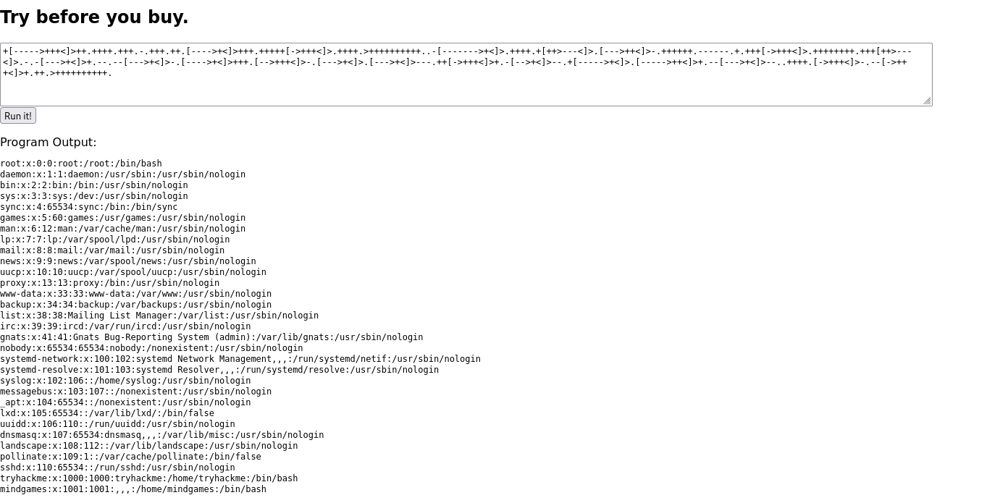

generatin reverse-shel. . .

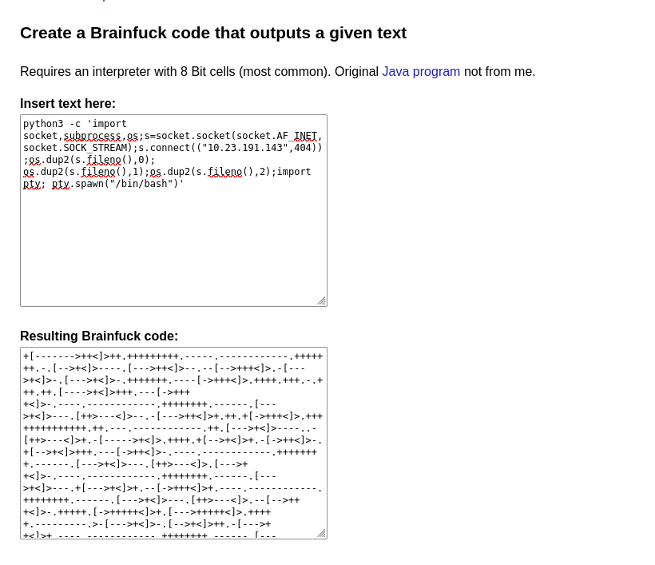

and starting nc -lnvp 404

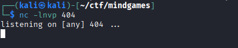

nice. We're in. id=1001.

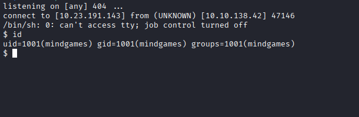

getting first flag.

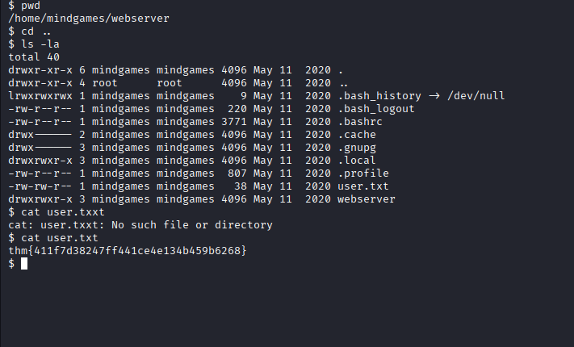

next step trying find vector attack

getcap -r / 2>/dev/null showing us interesting string

getcap res:

okay, i writted simple C exploit, now we should throw this exploit on the server using python http server

if u wanna try it self this exploit, i wroted compile.sh.

okay, now starting python server

okay, now after getted our exploit, running this using command

'/usr/bin/openssl req -engine /tmp/openssl.so'

and BOOM. root(uid=0)

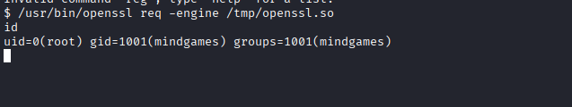

getting 2nd flag.

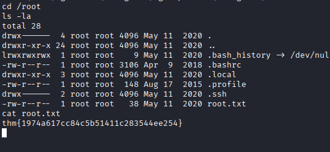

ty all for reading.

# Goodbye.
