# Hello 

### CTF: mrrobot(medium)
### IP: 10.10.203.238

##  nmap res:

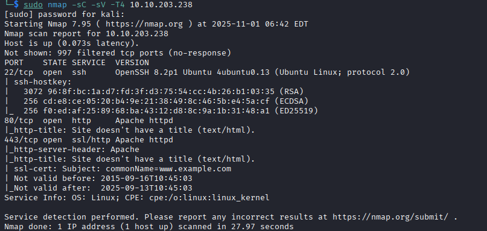

* 22 port(http)
* 80 port(http)
## ffuf res:

(sorry i lost screenshot >: )

interesting: robots wp-login(wordpress) 

checking robots.txt and getting information: 
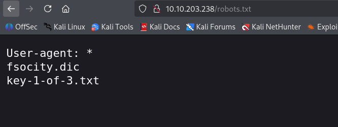

1 key + wordlist

using wget to download the wordlist

okay, now going to wp-login
using burp we can brute-force login using fsocity.dic
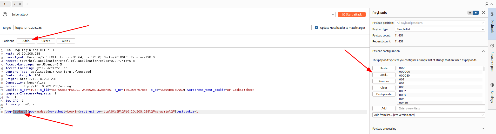

nice! login: Elliot.

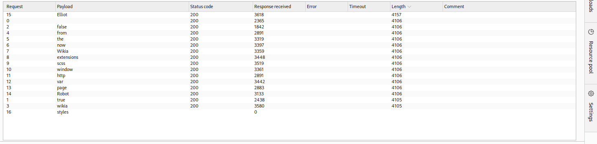

password i'll brute using hydra(cause this tools faster then burp suite)
Why? Because Hydra written on C, burp suite written on Java.

after brute-force i got password: ER28-0652 
(this is Elliot's Employee Number)

now we can try login into wp panel using creds: 
login: Elliot
password: ER28-0652 

okay, now going to Appearance -> Editor -> 404.php(here i'll paste reverse php) 
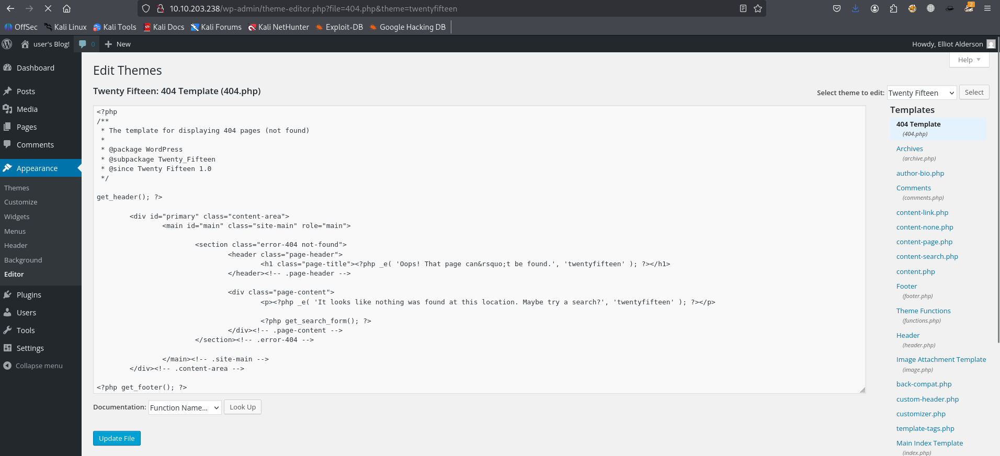

after editing starting netcat -lnvp $PORT (in my case 404) 
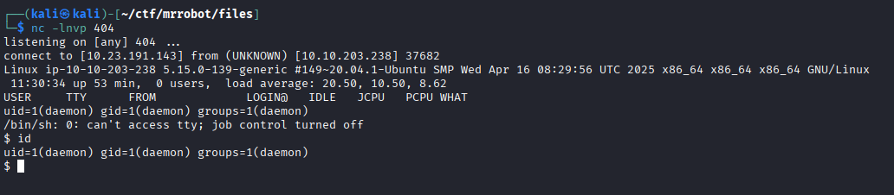

using export TERM=xterm && python3 -c 'import pty;pty.spawn("/bin/bash")'
we can get normal shell 

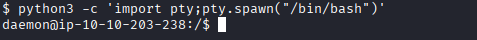

going to home directory /home/robot we can read file which have hashed(md5) password from the user

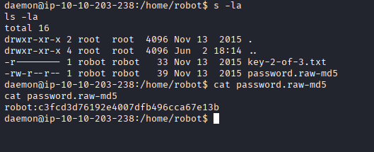

using crackstation we can try find password

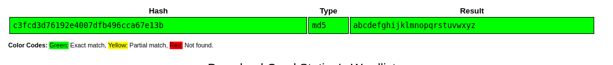

nice! we have password from user robot:abcdefghijklmnopqrstuvwxyz

getting 2nd flag and trying find now vuln to priv esc. 

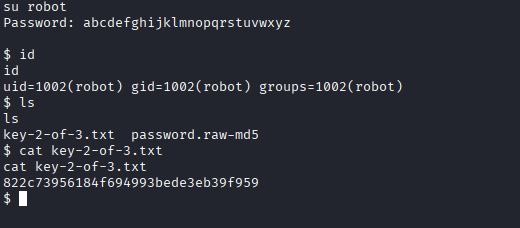

okay, we have target(nmap) which can help us get uid=0(root) going to gtfobins

sudo nmap --interactive
nmap> !sh

and yes, we are root.

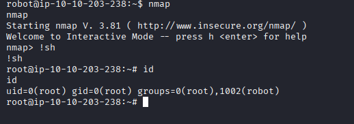

getting last flags. . . 

Ty all for reading!

# Goodbye.
